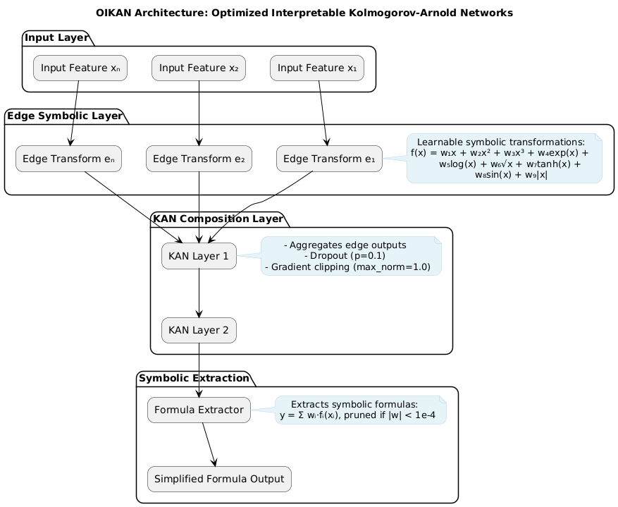

<!-- logo in the center -->
<div align="center">


<h1>OIKAN: Optimized Interpretable Kolmogorov-Arnold Networks</h1>
</div>

## Overview
OIKAN (Optimized Interpretable Kolmogorov-Arnold Networks) is a neuro-symbolic ML framework that combines modern neural networks with classical Kolmogorov-Arnold representation theory. It provides interpretable machine learning solutions through automatic extraction of symbolic mathematical formulas from trained models.

[](https://badge.fury.io/py/oikan)
[](https://pypistats.org/packages/oikan)
[](https://pepy.tech/projects/oikan)
[](https://opensource.org/licenses/MIT)
[](https://github.com/silvermete0r/oikan/issues)
[](https://silvermete0r.github.io/oikan/)

## Key Features
- 🧠 **Neuro-Symbolic ML**: Combines neural network learning with symbolic mathematics
- 📊 **Automatic Formula Extraction**: Generates human-readable mathematical expressions
- 🎯 **Scikit-learn Compatible**: Familiar `.fit()` and `.predict()` interface
- 🚀 **Production-Ready**: Export symbolic formulas for lightweight deployment
- 📈 **Multi-Task**: Supports both regression and classification problems

## Scientific Foundation

OIKAN is based on Kolmogorov's superposition theorem, which states that any multivariate continuous function can be represented as a composition of single-variable functions. We leverage this theory by:

1. Using neural networks to learn optimal basis functions through interpretable edge transformations
2. Combining transformed features using learnable weights
3. Automatically extracting human-readable symbolic formulas

## Quick Start

### Installation

#### Method 1: Via PyPI (Recommended)
```bash
pip install -qU oikan
```

#### Method 2: Local Development
```bash
git clone https://github.com/silvermete0r/OIKAN.git
cd OIKAN
pip install -e .  # Install in development mode
```

### Regression Example
```python
from oikan.model import OIKANRegressor
from sklearn.model_selection import train_test_split

# Initialize model with optimal architecture
model = OIKANRegressor(
    hidden_dims=[16, 8],  # Network architecture
    num_basis=10,         # Number of basis functions
    degree=3,             # Polynomial degree
    dropout=0.1           # Regularization
)

# Fit model (sklearn-style)
model.fit(X_train, y_train, epochs=200, lr=0.01)

# Get predictions
y_pred = model.predict(X_test)

# Save interpretable formula to file with auto-generated guidelines
# The output file will contain:
# - Detailed symbolic formulas for each feature
# - Instructions for practical implementation
# - Recommendations for production deployment
model.save_symbolic_formula("regression_formula.txt")
```

*Example of the saved symbolic formula instructions: [outputs/regression_symbolic_formula.txt](outputs/regression_symbolic_formula.txt)*


### Classification Example
```python
from oikan.model import OIKANClassifier

# Similar sklearn-style interface for classification
model = OIKANClassifier(hidden_dims=[16, 8])
model.fit(X_train, y_train)
probas = model.predict_proba(X_test)

# Save classification formulas with implementation guidelines
# The output file will contain:
# - Decision boundary formulas for each class
# - Softmax application instructions
# - Production deployment recommendations
model.save_symbolic_formula("classification_formula.txt")
```

*Example of the saved symbolic formula instructions: [outputs/classification_symbolic_formula.txt](outputs/classification_symbolic_formula.txt)*

## Architecture Details

OIKAN implements a novel neuro-symbolic architecture based on Kolmogorov-Arnold representation theory through three specialized components:

1. **Edge Symbolic Layer**: Learns interpretable single-variable transformations
   - Adaptive basis function composition using 9 core functions:
     ```python
     ADVANCED_LIB = {
         'x':    ('x', lambda x: x),
         'x^2':  ('x^2', lambda x: x**2),
         'x^3':  ('x^3', lambda x: x**3),
         'exp':  ('exp(x)', lambda x: np.exp(x)),
         'log':  ('log(x)', lambda x: np.log(abs(x) + 1)),
         'sqrt': ('sqrt(x)', lambda x: np.sqrt(abs(x))),
         'tanh': ('tanh(x)', lambda x: np.tanh(x)),
         'sin':  ('sin(x)', lambda x: np.sin(x)),
         'abs':  ('abs(x)', lambda x: np.abs(x))
     }
     ```
   - Each input feature is transformed through these basis functions
   - Learnable weights determine the optimal combination

2. **Neural Composition Layer**: Multi-layer feature aggregation
   - Direct feature-to-feature connections through KAN layers
   - Dropout regularization (p=0.1 default) for robust learning
   - Gradient clipping (max_norm=1.0) for stable training
   - User-configurable hidden layer dimensions

3. **Symbolic Extraction Layer**: Generates production-ready formulas
   - Weight-based term pruning (threshold=1e-4)
   - Automatic coefficient optimization
   - Human-readable mathematical expressions
   - Exportable to lightweight production code

### Architecture Diagram



### Key Design Principles

1. **Interpretability First**: All transformations maintain clear mathematical meaning
2. **Scikit-learn Compatibility**: Familiar `.fit()` and `.predict()` interface
3. **Production Ready**: Export formulas as lightweight mathematical expressions
4. **Automatic Simplification**: Remove insignificant terms (|w| < 1e-4)

## Model Components

1. **Symbolic Edge Functions**
   ```python
   class EdgeActivation(nn.Module):
       """Learnable edge activation with basis functions"""
       def forward(self, x):
           return sum(self.weights[i] * basis[i](x) for i in range(self.num_basis))
   ```

2. **KAN Layer Implementation**
   ```python
   class KANLayer(nn.Module):
       """Kolmogorov-Arnold Network layer"""
       def forward(self, x):
           edge_outputs = [self.edges[i](x[:,i]) for i in range(self.input_dim)]
           return self.combine(edge_outputs)
   ```

3. **Formula Extraction**
   ```python
   def get_symbolic_formula(self):
       """Extract interpretable mathematical expression"""
       terms = []
       for i, edge in enumerate(self.edges):
           if abs(self.weights[i]) > threshold:
               terms.append(f"{self.weights[i]:.4f} * {edge.formula}")
       return " + ".join(terms)
   ```

### Key Design Principles

- **Modular Architecture**: Each component is independent and replaceable
- **Interpretability First**: All transformations maintain symbolic representations
- **Automatic Simplification**: Removes insignificant terms and combines similar expressions
- **Production Ready**: Export formulas for lightweight deployment

## Contributing

We welcome contributions! Key areas of interest:

- Model architecture improvements
- Novel basis function implementations
- Improved symbolic extraction algorithms
- Real-world case studies and applications
- Performance optimizations

Please see [CONTRIBUTING.md](CONTRIBUTING.md) for guidelines.

## Citation

If you use OIKAN in your research, please cite:

```bibtex
@software{oikan2025,
  title = {OIKAN: Optimized Interpretable Kolmogorov-Arnold Networks},
  author = {Zhalgasbayev, Arman},
  year = {2025},
  url = {https://github.com/silvermete0r/OIKAN}
}
```

## License
This project is licensed under the MIT License - see the [LICENSE](LICENSE) file for details.